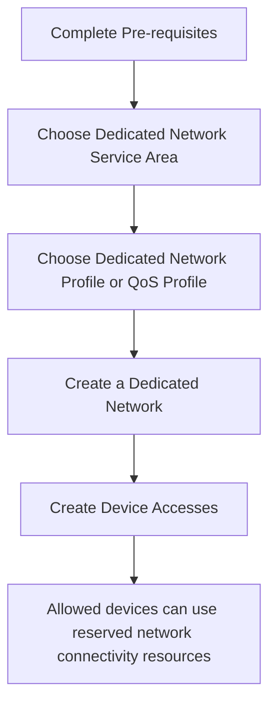
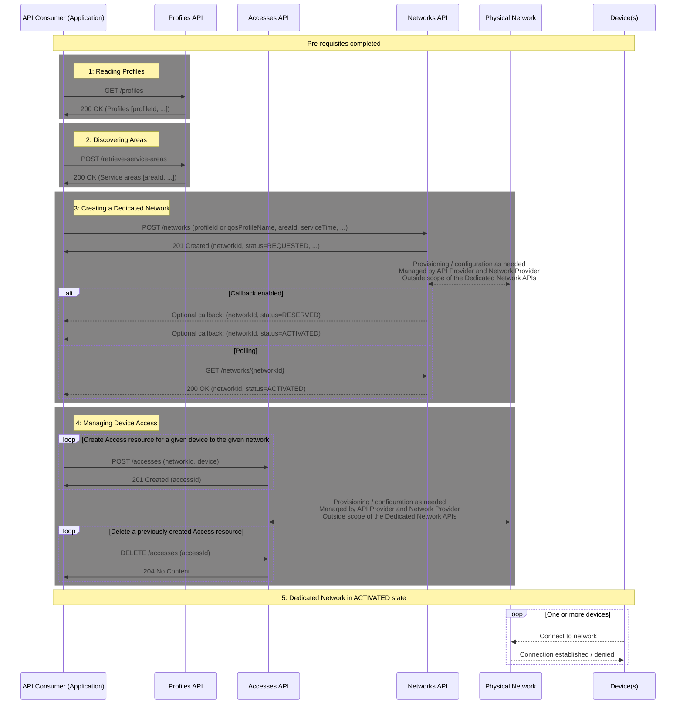
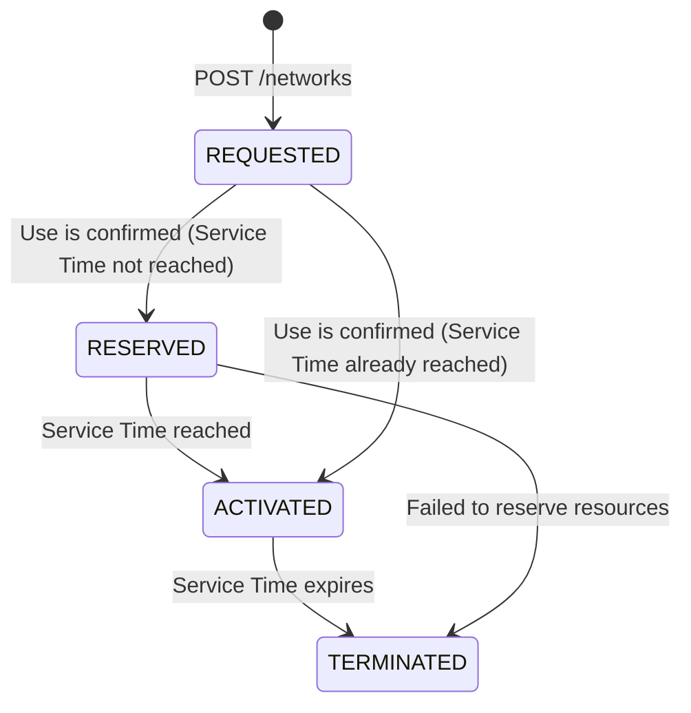

# High level description of Dedicated Networks concept and APIs
## Introduction
_Dedicated Networks_ enable dedicated use of public network connectivity resources by reserving some of these resources for use by devices and applications. To these devices and applications, the reserved resources appear as their own virtual or logical network. Please check [here](https://github.com/camaraproject/DedicatedNetworks/blob/r1.1/documentation/SupportingDocuments/UsageScenarios.md) for several usage scenarios for Dedicated Networks.

Fixed and Mobile Networks already offer the capability of separating devices into different networks. These concepts are sometimes called logical networks or virtual private networks. Multiple of these networks can coexist on the same physical network and can separate target traffic from other traffic for assured performance, enhanced security and other scenarios where consistent experience is required.

There are different options to technically realize a Dedicated Network. For example:

- Using 5G Network Slices (see 3GPP 23.501 Rel-15, clause 5.15)

- Using 5G Non-Public Networks (NPN), specifically the Public Network Integrated NPN (PNI-NPN), see 3GPP 23.501 Rel-16, clause 5.30)

- Using a separate 4G APN (see 3GPP 23.401 Rel-8) or 5G DNNs (see 3GPP 23.501 Rel-15). Note, a DNN is equivalent to an APN, per 3GPP 23.003 Rel-15.

Dedicated Networks abstract the complexity across **Network Provider** realizations to enable coherent use of diverse network capabilities.

A Dedicated Network is often only needed for a specific time duration (e.g. one hour) and at specific locations (e.g. the area of a festival). These are referred to as Service Time and Service Area.

The CAMARA Dedicated Network APIs allow **API Consumers** to programmatically manage Dedicated Networks, without the need for in-depth knowledge of telecommunications systems.

API Consumers have control over which devices are allowed to access and use the reserved network connectivity resources. In addition, network connectivity characteristics, for example, routing and performance may be individually tailored for each device.

Detailed characteristics, behaviors and costs pertaining to Dedicated Networks are typically described by the **API Provider** in the terms and conditions. Such terms and conditions may also contain obligations and restrictions.

An API Provider realizes Dedicated Networks based on the physical network resources managed by a Network Provider. An API Provider can be the Network Provider.

The present set of [Usage Scenarios](../SupportingDocuments/UsageScenarios.md) focuses on B2B use-cases, where the owner of the devices / device subscriptions is also acting as API invoker for the Networks and the Accesses APIs. This constellation allows using using the MSISDN as device identifier with a two-legged access tokens, since no additional consent needs to be obtained.

**Key roles**

| **Role Name** | **Description** |
| ---- | ------- |
| API Consumer | The entity that consumes the Dedicated Network APIs |
| API Provider | The entity that provides the Dedicated Network APIs |
| Network Provider | The entity that provides the physical network resources |

## Dedicated Network APIs

The CAMARA Dedicated Network APIs allow for programmatic management of Dedicated Networks, without the need for in-depth knowledge of telecommunications systems.

The APIs are summarized in the table below followed by a brief description. Detailed descriptions are provided within each specification.

| **API** | **Purpose of the API** | **Key Abstractions and concepts** |
| ---- | ------- | ----|
| Dedicated Network API | Reservation and lifecycle management of network connectivity resources for dedicated use. | A Dedicated Network is a logical resource and is used to embody the reservation of network connectivity resources in the physical network. Initiating a new reservation request using this API results in a new Dedicated Network resource being created. The Dedicated Network undergoes various lifecycle States including REQUESTED, RESERVED, ACTIVATED and TERMINATED. Reservation of resources occurs based on the selected Network Profile, duration when the reservation is needed (Service Time) and geographical areas where the service is needed (Service Area). |
| Dedicated Network Profiles API | Discovery of predefined set of network capabilities and performance characteristics | A Network Profile represents a predefined set of network capabilities and performance characteristics that can be applied when creating dedicated networks. Each profile represents a validated, supported configuration that has been pre-approved in the _terms and conditions_ between the API Provider and API Consumer. |
| Dedicated Network Areas API | Discovery of network service areas with support for network profiles and QoS profiles | A Network Service Area represents a  geographical area with coverage consistent with one or more network profiles and/or one or more QoS profiles. It enables API Consumers to select the geographical area where they can expect to consume the reserved network connectivity resources. A Network Service Area may have been pre-agreed between the API Provider and API Consumer in the _terms and conditions_ between the API Provider and API Consumer. |
| Dedicated Network Accesses API | Managing access to the Dedicated Network, i.e., controlling which devices may benefit from the reserved resources and capabilities | A Device Access represents the permission for a specific device to use a Dedicated Network's reserved connectivity resources. The usage of resources can be tailored to each device within the constraints of the applicable Network Profile. The access for devices to the network can only be managed when the Network is created and not in the TERMINATED [state](#states-of-the-network). |

The Accesses and the Network Profile re-use the concept of named QoS Profiles from [QualityOnDemand](https://github.com/camaraproject/QualityOnDemand) for describing connectivity performance characteristics. An API provider may offer the `qos-profiles` API for resolving a QoS Profile name into characteristics of a specific QoS profile.

When multiple QoS profiles are defined within a Network Profile, the API Consumer may either statically assign a different QoS profile (from the set of QoS profiles) for each device access or may dynamically create QoS Sessions using the QualityOnDemand `quality-on-demand` API.
The API Consumer may also restict the list of possible QoS Profiles within a Device Access.

A high-level sequence of steps involved when using Dedicated Network APIs is depicted in the diagram below and further described in their respective sections.

**Figure**: High-level sequence of steps 

## Pre-requisites

Before Dedicated Network APIs can be invoked, relevant agreements need to be in place between the API Consumer and the API Provider. Conceptually, the agreement contains all the different terms and conditions, which typically include price, service descriptions and conditions. It also includes obligations and restrictions possibly for both, the API Provider and the API Consumer, etc.

An API Provider may provide a catalog where API Consumers can get an overview of the various options available. For example, there may be a catalog of available APIs, and a catalog of available parameter sets for each of the APIs.

The API Provider may also offer a procedure for requesting additional customization, for example, additional Service Areas or Network Profiles. Such a procedure can leverage conventional methods such as emails or phone conversations.

API Consumers selects from available Network Profiles, QoS profiles, and Service Areas offered by the API Provider which then become part of the agreed terms and conditions.

This preparation phase is **outside the scope** of the Dedicated Network APIs.

As result of the agreement on the terms and conditions, the following aspects are determined

- URLs and credentials for the API Consumer to use

- A set of capabilities and performance targets (Network Profiles and QoS Profiles) that an API Consumer is eligible to use

- A set of geographic areas (Service Areas) that an API Consumer is eligible to use

- The API Consumer is aware about the terms and conditions (incl price), when selecting different parameter or parameter combinations according to the conditions.

Note that, at completion of the pre-requisites, no network connectivity resources are reserved, i.e., no Dedicated Network is created.

## Detailed high-level flow
The diagram below attempts to depict the complete flow including API endpoint, response codes, and key parameters.

**Figure**: High Level Flow with additional details

Description of main steps
1. Reading Profiles: The API Consumer is reading the eligible Network Profiles. Each Network Profile contains properties, like aggregated throughput or QoS profiles. Reading of the eligible QoS Profiles may also occur in this step (not shown in the diagram).
    * The terms and conditions (see [Pre-requisites](#pre-requisites)) may define the conditions, constrains, etc for using the profile.
1. Discovering Areas: The API Consumer is retrieving the eligible Network Service Areas. Each Network Service Area contains properties, like the areas's geographical coordinates and supported network profiles and QoS profiles.
    * The terms and conditions (see [Pre-requisites](#pre-requisites)) may define the conditions, constrains, etc for using the service area.
1. Creating a Dedicated Network: The API Consumer creates a network, providing the network profile or QoS profile, service time and service area as input parameters
    * The network is initially in REQUESTED state. See [network lifecycle](#states-of-the-network) for more information.
    * The API Consumer can register a sink for receiving network state changes.
1.  Managing Device Access: The API Consumer may allow one or more devices to get access to the capabilities and pcapacity of the network
    * The API Consumer may use the Accesses API, while the network is either in REQUESTED, RESERVED or ACTIVATED state. The API Consumer gets an error code, when using the Accesses API with a Network in TERMINATED state.
        * Creating an Access resource corresponds to giving access for a device to the network.
        * Deleting an Access resource corresponds to revoking access for a device to the network.
1.  When Dedicated Network is in ACTIVATED state: Devices with access will be able to connect to the network.
    * When a single QoS profile is used or a default QoS profile is defined within the Network Profile (or changed via the Access resources), all the traffic of the device will be treated with this QoS profile as default
    * When multiple QoS profiles are defined within the Network Profile (or changed via the Access resources), the API Consumer may use the QOD API for managing QoS Sessions with the QoS Profiles listed in the Network Profile.

## States of the network

The dedicated network supports multiple states, i.e. REQUESTED, RESERVED, ACTIVATED and TERMINATED. The networks resource is created with a POST on the /networks API. The status of the HTTP resource is independent of the status of the representing dedicated network.

On successful acceptance of the request, an HTTP resource is created. The response always returns a REQUESTED State. Reserved resources are only usable when the network is in ACTIVATED state.

**Figure**: lifecycle of a network

Explainations
- A network in REQUESTED state is not (yet) committed by the Network Provider.

- A network in RESERVED state is committed to be available for use during the Service Time by the Network Provider.

- The targeted resources of the network are free to be used by other users or for other purposes, while the network is in RESERVED state.

- Reserved resources are only usable when the network is in ACTIVATED state.

- The network may enter the ACTIVATED state directly after the REQUESTED state if the service start time has been reached when the API Provider successfully completed the resource reservation.

- The network may enter the TERMINATED state directly after the REQUESTED state if the API Provider could not complete the resource reservation.

- A network in TERMINATED state cannot be modified anymore and should be deleted. If not deleted by the API Consumer, the representing HTTP resource (URL) may be removed by the API Provider.
